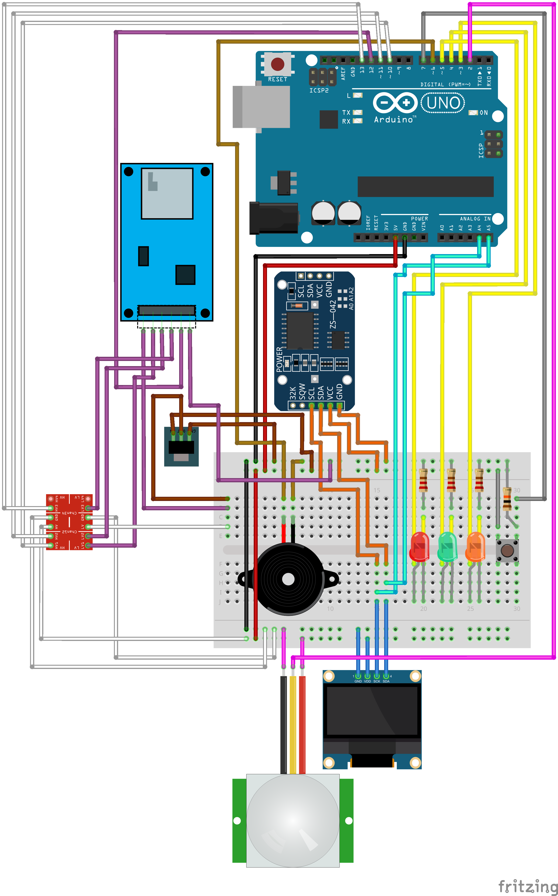
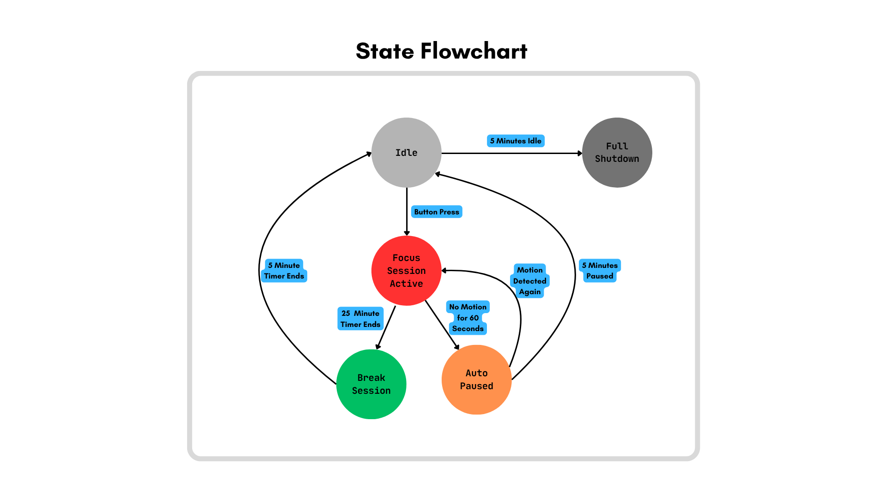

# Smart Pomodoro Timer 
Arduino-based Pomodoro timer with motion detection and logging. Work in Progress.

## Purpose

The Smart Pomodoro Timer is a physical productivity tool designed to help you stay focused using the Pomodoro Technique. It combines a 25-minute focus timer with a 5-minute break cycle, enhanced by motion detection to pause or shut down if you leave your desk. Visual and audio feedback keep you aware of your state, and an SD card logs your work sessions for later review. This project blends embedded systems and productivity design for makers, students, and engineers.

## Demo Videos

### Video 1 – LED + Button (state machine test)
- Shows: Idle → Focus → Break → Idle, and Idle → Shutdown after some seconds 
- Link: https://youtu.be/eCMTr3EPzk4

### Video 2 – PIR Auto-Pause and Buzzer
- Shows: Auto-pause on no motion, resume on motion with buzzer to signify state change
- Link: https://youtu.be/DpqMGeNr8Wc

### Video 3 – OLED Countdown (coming soon)
- Shows: Focus/Break countdown on SSD1306
- Link: (TBD)

### Video 4 – SD Logging (coming soon)
- Shows: Log entries written to microSD with timestamps
- Link: (TBD)

## Features

- 25-minute focus sessions with 5-minute breaks
- Auto-pause after 60 seconds of no motion (PIR sensor)
- Auto-return to Idle if paused for 5 minutes
- Auto-shutdown after 5 minutes of inactivity in Idle state
- OLED display shows countdown and state messages
- LED changes color to reflect current state
- Buzzer beeps for state transitions
- Logs session timestamps to microSD card with DS3231 RTC

## Hardware Used

- Arduino Uno
- PIR motion sensor
- OLED display (I2C)
- MicroSD card module
- DS3231 RTC module
- Push button
- Red LED
- Green LED
- Orange LED
- Passive Buzzer
- AMS1117 5V to 3.3V Voltage Regulator
- Bi-Directional 5V to 3.3V Logic Level Shifter (4-Channel)
- Jumper wires, breadboard, electrical components
- 3D-printed case (optional)

## Circuit Diagram

## State Diagram

## Documentation

- [Timer States](docs/states-and-behavior.pdf)
- [Parts List](docs/parts-for-timer.pdf)

## Log Output Example
[2025-06-12 10:00] Focus started 
[2025-06-12 10:25] Focus ended 
[2025-06-12 10:25] Break started 
[2025-06-12 10:30] Break ended 

Logs are saved to SD card with timestamps from the DS3231 RTC module.

## Getting Started

1. Clone this repository
2. Upload the code from `/firmware/` to your Arduino board
3. Connect the components as shown in the circuit diagram
4. Insert a microSD card and power the system
5. Press the button to start your first focus session!

## To Do
- [x] Defined timer logic and system states
- [x] Created state diagram
- [x] Wrote detailed project README
- [x] Documented timer states and parts list in `/docs/`
- [x] Create and upload circuit diagram to `/hardware/`
- [x] Build on breadboard
- [x] Test timer and motion detection logic (auto-pause, idle reset)
- [ ] Verify SD card logging with DS3231 timestamps
- [ ] Write and upload entire Arduino code to `/firmware/`
- [ ] Capture and upload real-world photos of the project (`/media/`)
- [ ] (Optional) 3D print or design an enclosure
- [ ] Record short demo video or GIF of the timer in action
- [ ] Final cleanup and code comments for release

## License

This project is open-source under the [MIT License](LICENSE).

Photos/diagrams/videos by Cayla Shipman

